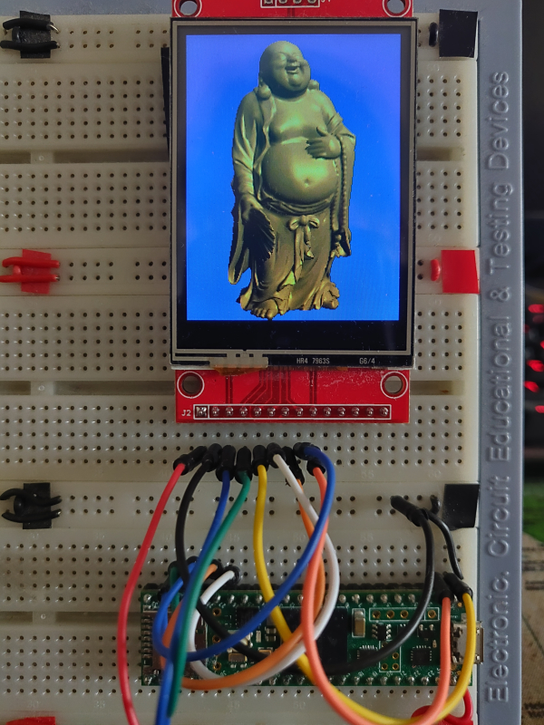

# TGX - A Tiny Graphics Library

***LATEST VERSION 1.0.5***

Full documentation is now available at https://vindar.github.io/tgx/

  

## 2D and 3D Graphics Library for 32-bit Microcontrollers

This library implements a set of classes that make it easy to draw 2D and 3D graphics onto a memory framebuffer. It is designed and optimized for 32-bit MCUs, yet it is cross-platform and also works on CPUs.

The library has been tested on:
- Teensy 3.5, 3.6, 4.0, 4.1  
- ESP32 family  
- Raspberry Pico 1/2 (RP2040/RP2350)  
- STM32 (STM32F4/STM32H7)  
- Desktop CPUs  

**Warning:** The goal of the library is to draw graphics **onto a memory framebuffer**. As such, it does not provide any hardware or screen support. You will need a screen driver to display the framebuffer on a physical screen. If you are using a Teensy 4.0/4.1 with an ILI9341 screen, consider using my [optimized driver](https://github.com/vindar/ILI9341_T4).

Here are the main features of the library:

### 2D Graphics

- Supports multiple color types: `RGB565`, `RGB24`, `RGB32`, `RGB64`, `RGBf`, and `HSV`. Every 2D/3D drawing operation is available for each color type.
- A templated `Image` class encapsulates a memory framebuffer and enables the creation of sub-images (i.e., views) that share the same buffer. This provides an elegant and efficient way to clip all drawing operations to a specific region.
- API (mostly) compatible with [Adafruit's GFX](https://github.com/adafruit/Adafruit-GFX-Library) and [Bodmer's TFT_eSPI](https://github.com/Bodmer/TFT_eSPI) libraries, but with more drawing primitives and usually faster! Primitives include *lines*, *triangles*, *rectangles*, *polygons*, *circles*, *ellipses*, *arcs*, *pies*, *Bezier curves*, *splines*, and more.
- Methods for blitting sprites with or without a transparent mask, supporting rotation and scaling. High-quality rendering is achieved using bilinear filtering and sub-pixel precision for smooth animations.
- Color type conversion and image resizing.
- Transparency support for all drawing methods. The `RGB32` and `RGB64` color types include an alpha channel for alpha blending. Types without an alpha channel still support basic blending via an opacity parameter available for most drawing primitives.
- Anti-aliased methods for drawing thick lines and circles.
- Support for Adafruit fonts and PJRC's ILI9341_t3 v1 and v2.3 anti-aliased fonts (see also <a href="https://github.com/vindar/tgx-font">tgx-font</a>).
- Python script to convert an image into a C file that can be directly imported into a project.
- Seamless integration with external libraries: [OpenFontRender](https://github.com/takkaO/OpenFontRender) (for TrueType fonts), [PNGdec](https://github.com/bitbank2/PNGdec) (for PNG), [JPEGDEC](https://github.com/bitbank2/JPEGDEC) (for JPEG), [AnimatedGIF](https://github.com/bitbank2/AnimatedGIF) (for GIF).

### 3D Graphics

- Heavily optimized pixel-perfect triangle rasterizer with selectable sub-pixel precision (2, 4, 6, or 8 bits).
- Depth buffer testing (16-bit or 32-bit precision).
- Two wireframe drawing modes: *fast* (simple lines, lower quality) and *slow* (higher quality, sub-pixel precision, anti-aliasing, customizable thickness).
- Flat and Gouraud shading.
- Phong lighting model with separate ambient, diffuse, and specular components (currently supports one directional light source).
- Per-object material properties.
- Perspective-correct texture mapping with selectable point sampling or bilinear filtering. Wrap modes: repeat (for power-of-two textures) or clamp to edge.
- Perspective and orthographic projection.
- Optional backface culling.
- Tile rasterization: render only part of the viewport at a time to save RAM, using a smaller image and z-buffer.
- Template classes for all required math operations: `Vec2`, `Vec3`, `Vec4` (vectors), `Mat4` (4×4 matrices), and `Box2` (2D box).
- Optimized mesh data format: meshes and textures can be read directly from flash memory to save RAM.
- Python scripts for easy conversion of texture images and 3D meshes (in Wavefront `.obj` format) into C files that can be directly imported into an Arduino project.

**Note:** A companion library, <a href="https://github.com/vindar/tgx-font">tgx-font</a>, provides a collection of plain and anti-aliased fonts for use with this library.

## Using the Library

- Full documentation is available [here](https://vindar.github.io/tgx/).
- Examples are located in the `/examples/` subfolder of the library and demonstrate how to use most of the library’s features.
