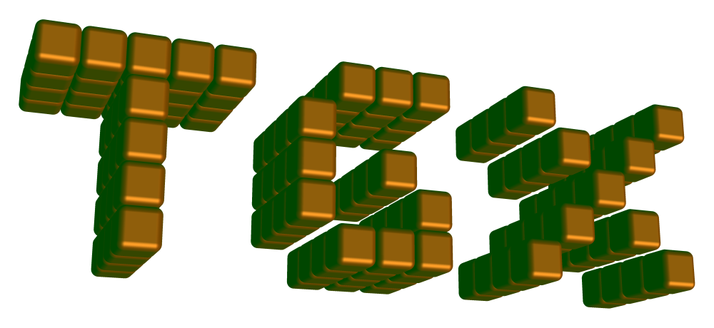

@mainpage TGX

@section about About the library

TGX is a tiny but full-featured C++ library for drawing 2D and 3D graphics onto a memory framebuffer.
The library runs on both microprocessors and microcontrollers but specifically targets 'powerful' 32 bits MCUs such as [ESP32 family (ESP32, ESP32S3, ESP32P4...)](https://www.espressif.com/en/products/socs/esp32), [RP2040/RP2350](https://www.raspberrypi.com/documentation/microcontrollers/silicon.html), [Teensy 3/4](https://www.pjrc.com/teensy/)...

**Features**

- Hardware agnostic: the library simply draws on a memory framebuffer.
- Optimized RAM usage and no dynamic allocation.
- No external dependency (and no C++ STL dependency): just include the `.h` and `.cpp` files into your project and you are set!
- Library in Arduino-friendly format.
- Multiple color formats supported: \ref tgx::RGB565 "RGB565",  \ref tgx::RGB24 "RGB24", \ref tgx::RGB32 "RGB32", \ref tgx::RGB64 "RGB64", \ref tgx::RGBf "RGBf", \ref tgx::HSV "HSV"
- \ref tgx::Image "Image" class that encapsulates a memory buffer and allows the creation of sub-images for clipping any drawing operations.
- **Extensive 2D API:**
    - Methods for converting, *blitting*, *copying and resizing sprites* with high quality (bilinear filtering, sub-pixel precision).
    - Methods for drawing *lines*, *polylines*, *polygons*, *triangles*, *rectangles*, *rounded rectangles*, *quads*, *circles*, *arcs*, *ellipses*, *Bezier curves and splines*.
    - Methods for drawing text with support for multiple font formats with anti-aliasing
    - Alpha-blending supported for all drawing operations.
    - Drawing methods come in two flavours:
        - *fast methods* : aim for speed over quality.
        - *high quality* : slower but uses anti-aliasing and/or sub-pixel precision.
    - Easy interfacing with other libraries for
        - drawing text with TrueType font using the [OpenFontRender library](https://github.com/takkaO/OpenFontRender)
        - drawing JPEG images using the [JPEGDEC library](https://github.com/bitbank2/JPEGDEC)
        - drawing PNG images using the [PNGdec library](https://github.com/bitbank2/PNGdec)
        - drawing (animated) GIF images using the [AnimatedGIF library](https://github.com/bitbank2/AnimatedGIF)
- **Extensive 3D API:**
    - Optimized 'pixel perfect' triangle rasterizer with adjustable sub-pixel precision.
    - Depth buffer testing (selectable 16 bits or 32 bits precision).
    - Multiple drawing modes: fast wireframe, antialiased wireframe and solid rendering with shaders.
    - Unlit, flat and Gouraud shading.
    - Phong lighting model with separate ambient/diffuse/specular color components.
    - Support for multiple directional lights and local point/spot lights.
    - Per object material properties.
    - Perspective-correct or affine texture mapping with selectable point sampling/bilinear filtering and multiple wrapping modes.
    - Perspective and orthographic projections.
    - Optional backface culling.
    - Tile rasterization: it is possible to render the viewport in multiple passes to save RAM.
    - Generated solid and wireframe primitives: cube, sphere, cylinder, cone and truncated cone.
    - Template classes for all the needed maths: \ref tgx::Vec2 "Vec2", \ref tgx::Vec3 "Vec3", \ref tgx::Vec4 "Vec4" (vectors), \ref tgx::Mat4 "Mat4" (4x4 matrix) and \ref tgx::Box2 "Box2", \ref tgx::Box3 "Box3" (boxes).
    - Legacy \ref tgx::Mesh3D "Mesh3D" and new meshlet-based \ref tgx::Mesh3Dv2 "Mesh3Dv2" model formats. Meshes and textures can be read from flash memory to save RAM.
- **Graphical tools with matching command-line versions:**
    - `tgx_image.py` to convert common image files to TGX image headers.
    - `tgx_mesh.py` to convert Wavefront `.obj` files or existing TGX meshes to `Mesh3D` or `Mesh3Dv2`.
    - `tgx_font.py` to convert TrueType/OpenType fonts to TGX-compatible font headers.
    - `tgx_info.py` to inspect generated TGX image, mesh and font files.

@section getting_started Getting started

1. @ref intro_install "Installation"
2. @ref intro_basic "Basic concepts"
3. @ref intro_api_2D "The 2D API."
4. @ref intro_api_3D "The 3D API."
5. @ref tools_mesh "TGX tools."

@note Do not forget to have a look at the examples located in `\examples` subfolder of the library.

@section References

**Basic classes (2D graphics)**

|                                   |                                                                       |
|-----------------------------------|-----------------------------------------------------------------------|
| Main image object                 | #tgx::Image                                                           |
| Color types                       | #tgx::RGB565,#tgx::RGB32,#tgx::RGB24,#tgx::RGBf,#tgx::RGB64,#tgx::HSV |
| 2D vectors                        | #tgx::Vec2                                                            |
| 2D box                            | #tgx::Box2                                                            |

**Additional classes specific to drawing 3D graphics**

|                                   |                            |
|-----------------------------------|----------------------------|
| Main class for drawing a 3D scene | #tgx::Renderer3D           |
| Legacy 3D model class             | #tgx::Mesh3D               |
| Compact meshlet model class       | #tgx::Mesh3Dv2             |
| 3D Box                            | #tgx::Box3                 |
| 3D and 4D vectors                 | #tgx::Vec3, #tgx::Vec4     |
| 4x4 matrix for 3D (quaternions)   | #tgx::Mat4                 |
